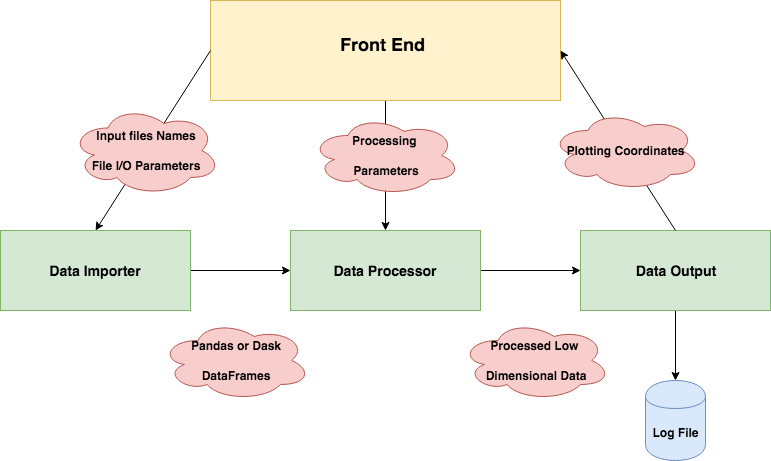

## Canadian Centre for Computational Genomics - GsoC 2019 Proposal

### Project Info

#### Human history and data visualization
The goal of this project is to create an easy-to-use python pipeline to produce such data visualizations from genomic data. The data needs to be dimensionally reduced to 2/3 dimensions using either PCA,UMAP,t-SNE or a combination of the above to generate insightful visualizations. 
***

### Student Bio

I am currently a Masters Student in AI at NUS. I developed a visualization dashboard using Bokeh and Python as part of GSoC 2017 for EMPA. I was a Visiting Researcher at ISI, Kolkata where I worked on predicting Cancer Survival Rates using Machine Learning Models on Molecular and Protien expression data of patients. I have industry exposure in Big Data while working for dDriven. I was responsible for creating an entire processing engine on top of Apache Spark. 
***

### Contact Information

Soumyadip Ghosh  
#09-595, 518 West Coast Road, Singapore - 120518  
+65 94261600  
gsoumyadip5@gmail.com  
Skype - gsoumyadip5  
***

### Student Affiliation

Masters in Computing ( AI Specialization )  
National University of Singapore  
Semester 2  
***

### Schedule Conflicts
I work as a Research Assistant in the department.
***
### Mentors 

Alex Diaz-Papkovich  
alex.diaz-papkovich@mail.mcgill.ca  
Yes, I have been working with Alex regarding the selection test and the project proposal over Email and Skype.  
***

### Method 

#### Goal
The goal of this project is to have an interactive application in the web-browser which enables the end-user to upload genomic data files of his/her choice, clean or extract relevant information, perform dimension reduction techniques ( PCA.t-SNE,UMAP or a combination) and plot the respective graphs. Addtionally, the user must be able to save the graphs and point coordinates to the local machine along with a log file containing all the parameters of the experiment. 

#### Challenges 
1. The data can be of varied formats - VCF Files, Population panel files, TSV, CSV or FASTA Files.
2. The processing steps may be varied and numerous, combining varioud files from user input. 
3. Genomic data is typically quite large ( 100000 * 100000) or more. Thus, data processing and visualization will take significant time. 
4. UMAP Library has certain bugs regarding small input matrices. 

#### Proposed Approach 

The solution would be a web application running in the browser. The solution composes of two parts 

1. A backend written in python for carrying out the necessary computation ( reading files, dimension reduction) 
2. A frontend composed of Bokeh and Datashader Elements for visualizing the data and for taking user input. 

##### Backend 

We plan to use the following open-source python libraries for this project. 

1. Bokeh
2. Scikit-Allel
3. Scikit-Learn 
4. Dask 
5. DataShader 
6. HoloViews
7. UMAP 

The proposed backend architecture comprises of three parts.

1. Data Importer Class - This class takes in the input file names and options from the front end and imports the data from the respective files. It would include  individual functions to support various file types ( VCF, CSV, TSV , Text ) and would either store the data Pandas Datafraems or in Dask Dataframes. Dask allows us to break up the data into small chunks and carry out parallel processing on it, which would be helpful, since our data is quite large. Scikit-Allel has functions to import VCF files. Pandas can be used to import CSV, TSV and Text Files. 

2. Data Processing Class - This class takes in the processing parameters from the input and the dataframes from the data Importer Class and carries out the necessary data cleaning, dimension reduction on them. (PCA, t-SNE and UMAP) would be the primary algorithms supported initially. PCA and t-SNE are functions available in the scikit-learn library. A python package implementing UMAP is also available.

3. Data Output Class - This class takes the processed data and sends it back to the front end for display. It also writes down the processed data files in a format specified from the front-end. Additionally, it also creates a log file for the entire operation. The output can be processed as numpy array written to a text or a csv file. The ouput image can also be saved via Bokeh to a PNG or JPG Format. The log file will be written as a text file by collecting all parameters of the classes.

##### Design Choices 

We surveyed a couple of front-end plotting libraries for this project, but they all suffer from the same issue of not handling large datasets well. 

1. Chartist.js https://github.com/gionkunz/chartist-js/issues/17
2. C3.js https://github.com/c3js/c3/issues/1075
3. Google Charts - https://stackoverflow.com/questions/42972492/google-charts-large-huge-data

The only charting library which could support large datasets reliably was dybala. http://dygraphs.com/
But, unfortunately, this library has very limited charting functionalities and also little interactive feature support. It does not have a scatter plot functionality which would be a primary requirement for this project. 

Bokeh is a complete Front End Library for Data Visualizations. It has a large range of charts and very flexible customization support. It also has very good tools for user interaction. Holoviews is a library built on top of Bokeh and it interfaces very well with the DataShader Library. The Datashader library can easily render Millions of points along with supporting user interaction. Plus, it supports geographical maps which could be used as a reference background to plot the points. 

[Displaying 300 million points](http://datashader.org/index.html)

[Bokeh Interaction](https://demo.bokeh.org/gapminder)

Scikit-Allel provides almost all the functions we need to import genetic data. It also supports parallel computation on Dask Dataframes. Scikit-Learn has an excellent implementation of t-SNE and PCA, supporting the randomized version of it as well. 

##### Front End

The front end would enable the user to provide inputs such as file names , process parameters and output file formats, while also providing a visualization window of the genomic data. The front end would be designed as shown below. 

The Front End would include options as follows.

1. Data Input - Files to read and their formats. Specific Columns to read. Index columns if any.
2. Data Processing - PCA,t-SNE and UMAP input parameters. 
3. Data Output Format - Data Output Format for the coordinate file. (CSV, Txt) . Export file format for image (PNG or JPG)
4. Data Visualization Window - Interactive Functions such as Zoom, Pan, Hover. 

##### Testing 
The tests are broken down for each module. 

1. Data Input - Whether the module can import files of all types required. Error Handling - If files are not present, files are corrupted or not in the specified format. 

2. Data Processing - Whether the datatypes of the data are in accordance with the algorithm inputs. A time-estimate for each type of algorithm on each size of dataset. 

3. Data Output - Whether the outuput file and image are correctly stored on disk. Does the log file include all necessary details to re run the experiment. 

#### Project Management

The entire code would be written in Python and shared via Github. Commits will be made weekly. Any problem/obstacles will be shared with the mentor over weekly skype calls. The timeline is as follows. The incode documentation will be done alongwith coding the respective Modules. 

Start Date | End Date | Work Description
------------ | ------------- | -----------
May 28 | June 4  | Data Importer Module
June 5 | June 7 | Data Importer Module Test and Timing Measurements
June 8 | June 25 | Data Processing Module
June 25 | June 27 | Data Processing Module Test and Timing Measurements
June 28 | July 16 | Data Output Module 
July 17 | July 20 | Data Ouptut Module Test and Timing Measurements
July 21 | August 13 | Tool Enhancements, Additional Visualizations ,
August 14 | August 27 | End User Documentation 

#### Test

The test comprised of visualizing the genomic variations of a population cohort. The entire details can be found here. 
[Proposal](https://github.com/gmomo/genome_viz)

